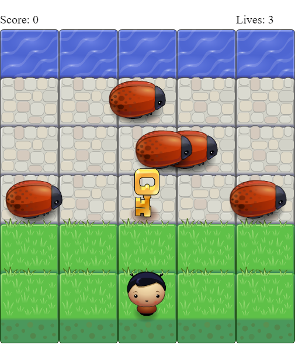

# Arcade Frog Game

- ### Indice
 1. [Como jogar](#como-jogar)
 2. [Dependencias](#dependencias)
 3. [Referências](#referências)

## Como jogar
 **Regras**

 - Para jogar, basta abrir ou **recarregar** a página.
 - O jogo começa com 5 joaninhas atravessando a tela.
 - Para mover o personagem, basta utilizar as teclas de direção (`left`, `up`,`down`,`right`).
 - Ao bater nos inimigos, o total de vidas é decrementado.
 - Ao pegar uma chave, um inimigo some do jogo
 - Quando todos os inimigos sumirem, a **chave** some e o jogo precisa ser reiniciado através do **recarregamento** da página.
 - Se o personagem bater varias vezes no inimigo e zerar a quantidade de (3) vidas, os inimigos ficaram agrupados nas 3 primeiras fileiras (independente da quantidade, se tiver mais de 3 inimigos, um ficará sobre o outro).

 

## Dependencias
Este jogo roda graças ao elemento `<canvas>` ([MDN Web Docs: Canvas](https://developer.mozilla.org/pt-BR/docs/Web/HTML/Canvas)), presente no HTML5.

Para  manipular o `<canvas>`, foi utilizado os arquivos da pasta *js*, nos quais:

- app.js é o responsável pela criação do conteúdo, incluindo as classes dos objetos e o controle do teclado.
- engine.js é o responsável pela renderização e pela criação do conteúdo de app.js e resources.js.
- resources.js cuida da parte de carregamento das imagens, para não precisar carregar essas imagens toda hora.

## Referências
http://udacity.com
